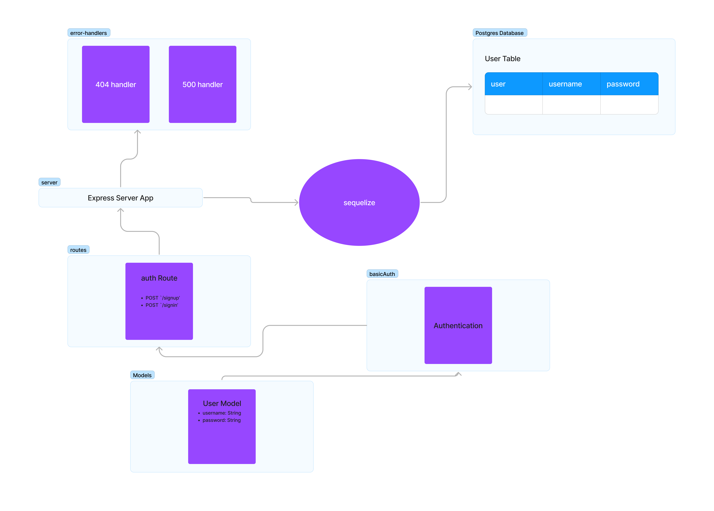

# LAB - Class 06

## Project: Basic Authentication

### Author: Bryan O. Garduno Gonzalez

### Problem Domain  

Construct an authentication system using Express that facilitates user signup and login. The system should be able to handle JSON and FORM data inputs, validate user credentials, and interact with a PostgreSQL database through Sequelize ORM for user management. Successful signup or login should return appropriate status codes and the user object, while errors should trigger the designated error handlers.

Features of this authentication system include:

1. **User Signup**: Users can create an account by making a POST request to the `/signup` route.
2. **User Login**: Existing users can login by making a POST request to the `/signin` route with proper authentication headers.
3. **Authentication Middleware**: Middleware that validates user login credentials and adds the user record to the request object.
4. **Sequelize Model**: The user model is defined using Sequelize, storing username and hashed password.
5. **Error Handling**: Efficient error handling mechanisms to manage invalid logins and other potential issues.

### Links and Resources

- [GitHub Actions ci/cd]() 
- Dev [back-end server dev branch url]()
- Main [back-end server main branch url]()

### Collaborators

[List any collaborators here, if any]

### Setup

#### `.env` requirements (where applicable)

A .env file is included in the local repository. A .env-sample file is uploaded to the remote repo so collaborators understand what environmental variables are being used.

#### How to initialize/run your application (where applicable)

- e.g. `npm start`

#### Features / Routes

- **Server Modularization:** 
  - Entry point at `index.js` initiates the server after a successful database connection.
  - Server logic in `server.js`, exporting a `start()` method and a reference to the Express app.

- **Middleware Implementation:**
  - **404 Not Found (`404.js`):** Handles all unrecognized routes and sends a 404 status.
  - **500 Server Error (`500.js`):** Manages server errors, sending a 500 status and error details.

- **User Authentication Routes:**
  - **Signup Route (`auth.js`):**
    - `POST /signup`: Signs up a new user.
  - **Signin Route (`auth.js`):**
    - `POST /signin`: Authenticates and logs in a user.

### Tests

- **How do you run tests?**

  Navigate to the project's root directory and run the command `npm test` to execute all the test suites.

- **Any tests of note?**

  The authentication system features comprehensive tests for both the routes (`authRoutes.test.js`) and the basic authentication middleware (`basicAuth.test.js`). These tests validate the functionality of user signup and login, ensuring correct status codes and responses for various scenarios, including valid credentials, duplicate usernames, and invalid logins.

- **Describe any tests that you did not complete, skipped, etc.**

  All planned tests for this phase of the project have been implemented and executed successfully. Future phases may introduce additional features and require new tests to be added for full coverage.

#### UML
;

